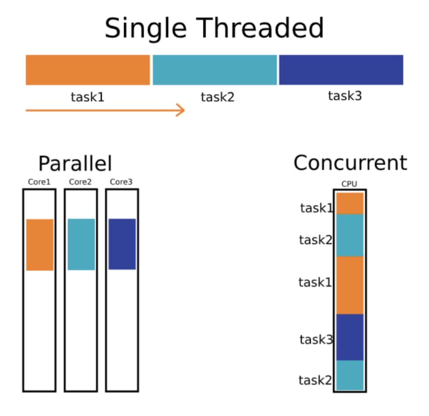
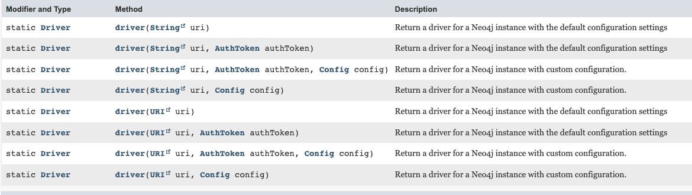
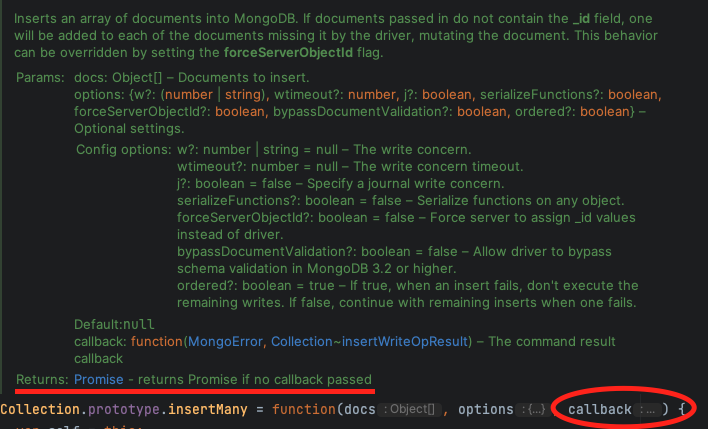
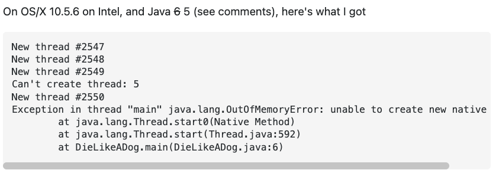
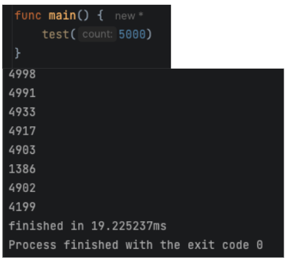
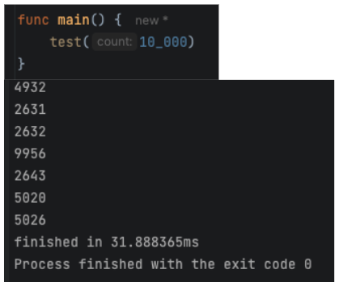
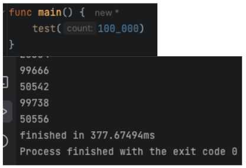
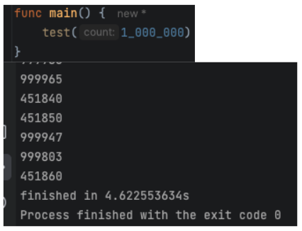
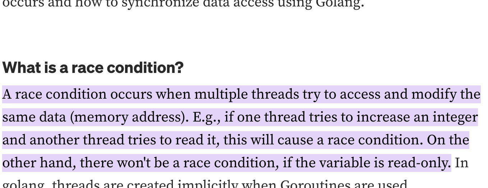
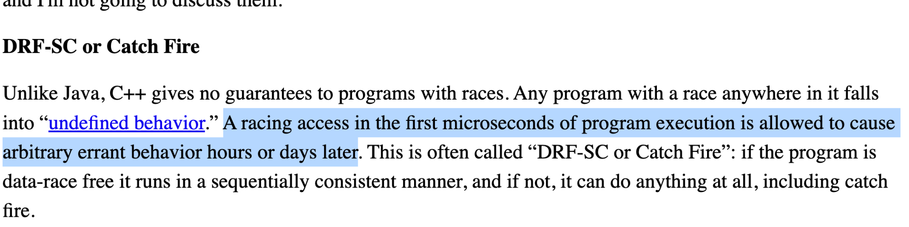

This post covers Go's concurrency model, including why it's unique among major programming languages, how goroutines work, race conditions and the memory model, and synchronization mechanisms.

<div class="series-nav">
  <div class="series-nav__title">Go Fundamentals Series</div>
  <div class="series-nav__subtitle">Article 3 of 4</div>
  <div class="series-nav__list">
    <a href="/go-fundamentals-variable-behavior" class="series-nav__item">1. Variable Behavior</a>
    <a href="/go-fundamentals-memory-architecture" class="series-nav__item">2. Memory Architecture</a>
    <span class="series-nav__item--current">3. Concurrency Model ← You are here</span>
    <a href="/go-fundamentals-error-handling" class="series-nav__item">4. Error Handling</a>
  </div>
</div>

## Mixed Concurrency Models

Out of the major programming languages: C, C++, C#, Rust, Python, PHP, Ruby, Java, Kotlin, Scala, Go - Go is the only one with a **fully consistent concurrency model**. What does that mean?

### The Problem with Mixed Models

Consider Java's blocking HTTP client:

```java
HttpClient client = HttpClient.newHttpClient();
HttpRequest request = HttpRequest.newBuilder()
    .uri(URI.create("https://example.com"))
    .build();
HttpResponse<String> response = client.send(request, HttpResponse.BodyHandlers.ofString());
```

Blocking code seems simpler. Why not use it everywhere? Because modern applications need better performance.


Java's async HTTP client looks like this:

```java
final SimpleHttpRequest request = SimpleHttpRequestBuilder.get()
    .setHttpHost(target)
    .setPath(requestUri)
    .build();

System.out.println("Executing request " + request);
final Future<SimpleHttpResponse> future = client.execute(
    SimpleRequestProducer.create(request),
    SimpleResponseConsumer.create(),
    new FutureCallback<SimpleHttpResponse>() {

        @Override
        public void completed(final SimpleHttpResponse response) {
            System.out.println(request + "->" + new StatusLine(response));
            System.out.println(response.getBody());
        }

        @Override
        public void failed(final Exception ex) {
            System.out.println(request + "->" + ex);
        }

        @Override
        public void cancelled() {
            System.out.println(request + " cancelled");
        }

    });
future.get();
```

Boy, that escalated quickly.<br/>
The syntax is more complex, but are there other issues?

**Async applications must not use blocking functions on async threads**, otherwise they completely freeze. This was a painful lesson learned with Java's Vertx framework - a single thread event loop architecture similar to NodeJS.



In this type of runtime, everything must be async, otherwise you block the main thread. Sometimes it's hard to tell if something is async or blocking, and if you miss that distinction, it can have **deadly effects** on production systems.

### Is It Blocking?

Take a look at this Java Neo4J client usage, is it blocking or not?

```java
Driver driver = GraphDatabase.driver("bolt://localhost", AuthTokens.basic("neo4j", "test"));
CompletionStage<StatementResultCursor> cursorStage = session.runAsync("UNWIND range(1, 10) AS x RETURN x");
cursorStage.thenCompose(StatementResultCursor::listAsync).whenComplete((records, error) -> {
    if (records != null) System.out.println( records );
    else error.printStackTrace();
    session.closeAsync();
});
```

Let's inspect the API docs. Do you understand if the `GraphDatabase.driver`, which might or might not be doing IO, is actually blocking or not?



All those major languages have these kinds of problems.<br/>
What about other languages? Other concurrency models? What about **JavaScript**?

## JavaScript Concurrency Model

JavaScript is more consistent - it's **single threaded** but there are **no blocking operations**.

HTTP client request in JavaScript:

```javascript
const Http = new XMLHttpRequest();
const url='https://jsonplaceholder.typicode.com/posts';
Http.open("GET", url);
Http.send();

Http.onreadystatechange = (e) => {
    console.log(Http.responseText)
}
```

Here, the syntax was the main issue - so much so that they called it **callback hell**.

From [callbackhell.com](http://callbackhell.com):


### Promises

In 2012 JavaScript officially supported **Promises** - a concept similar to Java/Python's `Future`:

```javascript
function fetchData() {
    return new Promise((resolve, reject) => {
        // async operation
        resolve(data);
    });
}
```

Now we have 2 concurrency models, which results in APIs that look like this to support both:



### Async/Await

In 2015, JavaScript introduced **async/await** (originally appeared in C# in 2011). This is much better because it provides the **performance of async code** but the **readability of blocking code**.

```javascript
const promise = axios.get("example.com")
const result = await promise;
console.log(result.body);
```

To understand the syntactical improvement, consider implementing a `findFirst404` function:

Without async/await, you can't use loops - you need a recursive implementation or use a library:

```javascript
function findFirst404(urls, callback, index = 0) {
    if (index >= urls.length) {
        callback(null);
        return;
    }
    fetch(urls[index])
        .then(response => {
            if (response.status === 404) {
                callback(urls[index]);
            } else {
                findFirst404(urls, callback, index + 1);
            }
        });
}
```

With **async/await** support:

```javascript
async function findFirst404(urls) {
    for (const url of urls) {
        const response = await fetch(url);
        if (response.status === 404) {
            return url;
        }
    }
    return null;
}
```

This is not better because it's easier or faster to write. It's better because it's easier to **reason about**, understand **implications**, find **concurrency issues** and **bugs**, **refactor**, and in general - **maintain**.

### Three Concurrency Models

This is very good except now we have 3 different concurrency models in JavaScript. Each works well on its own.

If we want to wait for 2 callback based functions:

```javascript
function waitForBoth(fn1, fn2) {
    let results = [];
    let count = 0;
    const callback = () => console.log('done');
    fn1((result) => { results[0] = result; if (++count === 2) callback(); });
    fn2((result) => { results[1] = result; if (++count === 2) callback(); });
}
```

Or using a library like `async`.<br/>
If we want to wait for 2 promise based functions:

```javascript
function waitForBoth(promise1, promise2) {
    Promise.all([promise1, promise2])
        .then(() => console.log('done'));
}
```

If we want to wait for 2 promise based functions using async/await:

```javascript
async function waitForBoth(promise1, promise2) {
    await Promise.all([promise1, promise2]);
    console.log('done');
}
```

But if we want to use a callback based function in an async/await function we must create a wrapper:

```javascript
function promisify(callbackFn) {
    return new Promise((resolve, reject) => {
        callbackFn((err, result) => {
            if (err) reject(err);
            else resolve(result);
        });
    });
}
```

So we end up with wrapper libraries for translating between concurrency models.


For instance, the default NodeJS native library is callback based. In v10 they introduced an altenative, promise based one. To add to the noise, there's also a blocking version of those. As we said, in most production use cases, using it can lead to huge problems.

### JavaScript Architecture Limitations

But this is not the end of the story.

Single thread architectures are not only vulnerable to blocking functions. They're also **vulnerable to long processing functions** due to lack of **preemption**.


This means any CPU intensive operation, or any long processing function immediately affects the **performance of the entire process**.

And in a process that mixes a lot of CPU operations with many IO calls, you get insane **spikes of latency**.

## Go Concurrency Model

A thread is an OS, kernel-space entity which is very expensive. It has a relatively large memory footprint, context switching between them is very expensive, and preemption times and optimizations are not accessible to the application itself, but rather, managed by the OS.

Go has an implementation of coroutines (first introduced in 1958!) called **goroutines**. Goroutines are user-space entities managed by the Go runtime. They are very cheap and context switching between them is super quick.

### Writing Concurrent Code in Go

As opposed to JavaScript or any other language, there's no blocking vs. async, no callback vs. promises. You can only write code that performs async IO, but it actually returns values because blocking a goroutine is close to free.

Example HTTP client:

```go
resp, err := http.Get("https://example.com")
if err != nil {
    log.Fatal(err)
}
defer resp.Body.Close()
body, err := io.ReadAll(resp.Body)
```

### Goroutine Performance

How cheap are goroutines actually?

Here's Java code trying to run several thousand threads (example take from [StackOverflow](https://stackoverflow.com/questions/763579/how-many-threads-can-a-java-vm-support/763584#763584)):

```java
public class ThreadStressTest {
    public static void main(String[] args) throws InterruptedException {
        int numThreads = Integer.parseInt(args[0]);
        Thread[] threads = new Thread[numThreads];
        for (int i = 0; i < numThreads; i++) {
            threads[i] = new Thread(() -> {
                try {
                    Thread.sleep(10000);
                } catch (InterruptedException e) {
                    e.printStackTrace();
                }
            });
            threads[i].start();
        }
        for (Thread thread : threads) {
            thread.join();
        }
    }
}
```

This is getting out of memory on a standard personal computer after several thousand threads have fired.


Here's the equivalent Go code:

```go
func main() {
    numGoroutines, _ := strconv.Atoi(os.Args[1])
    var wg sync.WaitGroup
    wg.Add(numGoroutines)
    for i := 0; i < numGoroutines; i++ {
        go func() {
            defer wg.Done()
            time.Sleep(10 * time.Second)
        }()
    }
    wg.Wait()
}
```

Here it is running on my own computer with 5k goroutines:



Can we do it with 10k?



Can we do it with 100k?



Can we do it with 1M?



My machine got loaded for a second or two, but completed the task at 4.6 seconds!

This is powerful, right? Under the hood, Go's runtime manages a minimal amount of OS threads to **utilize all available cores and resources** while providing the **best performance**. And with those threads, it performs only async operations.

You never encounter a different concurrency paradigm, you never have to adapt or mix them. **Everything looks blocking**, **everything performs async**.

A fully consistent concurrency model. It always looks and performs the same.

## Race Conditions and Memory Model



### Race Conditions in Go

In Go, we have 3 levels of **race conditions**:

1. Those that cause the process to crash
2. Those that create logical issues
3. Those that don't make a direct impact

What will happen here?

```go
func main() {
    m := make(map[int]int)
    go func() {
        for {
            m[1] = 1
        }
    }()
    go func() {
        for {
            _ = m[1]
        }
    }()
    select {}
}
```

<details>
<summary>Click to reveal answer</summary>
<div markdown="1">

This is the **first type** - the process will crash with a fatal error: concurrent map read and map write.

</div>
</details>
<br/>

What will happen here?

```go
func main() {
    value := 0
    go func() {
        for i := 0; i < 1000; i++ {
            value++
        }
    }()
    go func() {
        for i := 0; i < 1000; i++ {
            value++
        }
    }()
    time.Sleep(time.Second)
    fmt.Println(value)
}
```

<details>
<summary>Click to reveal answer</summary>
<div markdown="1">

This is the **second type** - the process will not crash, but the output is unexpected. The result will be less than 2000 due to the race condition.

</div>
</details>
<br/>

What will happen here?

```go
func main() {
    var value int
    go func() {
        for i := 0; i < 1000; i++ {
            value = i
        }
    }()
    go func() {
        for i := 0; i < 1000; i++ {
            fmt.Println(value)
        }
    }()
    time.Sleep(time.Second)
}
```

<details>
<summary>Click to reveal answer</summary>
<div markdown="1">

Nothing suspicious on the surface. This is the **third type**. Setting `value = i` is an atomic operation so the values on the other thread are reasonable. However, this is still a race condition and is unsafe.

</div>
</details>

### Memory Model

Race conditions, even the ones that seem harmless, are **unsafe**. They are defined by the language memory model.

A language **memory model** is part of the **language specification**. Each compiler implementing the language must meet this specification.

Language memory models define **guarantees** compilers must make in case of multiple cores operating on the same memory address.

The stronger the guarantees are, the less optimizations the compiler is allowed to implement.

#### Historical Examples

**Java's original memory model (1996)** made such strong guarantees that compilers had to **give up fundamental optimizations**. This led to Java announcing a completely new memory model in 2004 and introduced breaking changes to the language spec.

**C++ memory model of 2011** took the other side of the trade-off, making no guarantees whatsoever on any racy process. This allows compilers to implement amazing optimizations, but when compiling racy code, they can literally do **anything**.



**Go's memory model** is a **middle ground** between these examples. It provides enough guarantees for programs to behave as you expect them, while allowing compilers to implement a wide variety of optimizations.

The **bottom line** of race conditions in Go is: Do not create race conditions. If you do, make sure you **understand the language memory model**! [Read here](https://go.dev/ref/mem#advice).

### Detecting Race Conditions

You can inspect your applications and find race conditions by running them with:

```bash
go run -race .
```

Example output:

```
==================
WARNING: DATA RACE
Read at 0x00c0000a4010 by goroutine 7:
  main.main.func2()
      /path/to/main.go:15 +0x3c

Previous write at 0x00c0000a4010 by goroutine 6:
  main.main.func1()
      /path/to/main.go:10 +0x4c
==================
```

### Further Reading

- [The Go Memory Model](https://go.dev/ref/mem) - from the official Go blog
- [Memory Model Research](https://research.swtch.com/mm) - an interesting read about the history of memory models in programming languages
- [Race Conditions in Golang](https://golangbot.com/mutex/) - an article about race conditions in Go, and how to detect them

## Synchronization Mechanisms

To avoid race conditions and synchronize threads, Go provides the following **synchronization mechanisms**:

- Locks
- Wait Groups
- Atomic Variables
- Channels
- sync.Map

### Locks

Let's use **locks** to synchronize a racy program.

Racy version:

```go
func main() {
    counter := 0
    for i := 0; i < 1000; i++ {
        go func() {
            counter++
        }()
    }
    time.Sleep(time.Second)
    fmt.Println(counter)
}
```

With a `sync.Mutex`:

```go
func main() {
    var mu sync.Mutex
    counter := 0
    for i := 0; i < 1000; i++ {
        go func() {
            mu.Lock()
            counter++
            mu.Unlock()
        }()
    }
    time.Sleep(time.Second)
    fmt.Println(counter)
}
```

With a `sync.RWMutex` for better performance when you have many readers:

```go
func main() {
    var mu sync.RWMutex
    counter := 0
    // Writer
    go func() {
        mu.Lock()
        counter++
        mu.Unlock()
    }()
    // Reader
    go func() {
        mu.RLock()
        fmt.Println(counter)
        mu.RUnlock()
    }()
}
```

### Sync Map

For concurrent map access, use `sync.Map`:

```go
var m sync.Map

m.Store("key", "value")
value, ok := m.Load("key")
m.Delete("key")
```

See [sync.Map documentation](https://pkg.go.dev/sync#Map) for more details.

### Atomic Variables

For simple counters or gauge values, atomic variables provide more readable code and better performance than locks.

Racy version:

```go
func main() {
    var value int64 = 0
    go func() {
        for i := 0; i < 1000; i++ {
            value++
        }
    }()
    go func() {
        for i := 0; i < 1000; i++ {
            fmt.Println(value)
        }
    }()
    time.Sleep(time.Second)
}
```

Fixed with atomic variables:

```go
func main() {
    var value int64 = 0
    go func() {
        for i := 0; i < 1000; i++ {
            atomic.AddInt64(&value, 1)
        }
    }()
    go func() {
        for i := 0; i < 1000; i++ {
            fmt.Println(atomic.LoadInt64(&value))
        }
    }()
    time.Sleep(time.Second)
}
```

### Wait Groups

What will be the output of the following program? Is there a race condition?

```go
func main() {
    for i := 0; i < 5; i++ {
        go func(n int) {
            fmt.Println(n)
        }(i)
    }
    fmt.Println("done")
}
```

<details>
<summary>Click to reveal answer</summary>
<div markdown="1">

The program will likely print "done" before all goroutines complete, or may not print all numbers. There's no race condition on data, but there's a synchronization issue - the main goroutine doesn't wait for the others to finish.

</div>
</details>
<br/>

Let's fix it using a `sync.WaitGroup`:

```go
func main() {
    var wg sync.WaitGroup
    for i := 0; i < 5; i++ {
        wg.Add(1)
        go func(n int) {
            defer wg.Done()
            fmt.Println(n)
        }(i)
    }
    wg.Wait()
    fmt.Println("done")
}
```

### Synchronization Use Cases

```markdown
| Mechanism        | Use Case                                                                                |
|------------------|-----------------------------------------------------------------------------------------|
| Lock             | Synchronizing access to variables                                                       |
| RWLock           | Synchronizing access to variables in a read/write use case to accelerate reads          |
| Atomic Variables | Synchronizing access to counters or gauge values for better performance and readability |
| WaitGroup        | Synchronizing events like waiting for threads to finish or some task to occur           |
```

### Channels

Channels are built-in types in Go. As opposed to the other mechanisms, they provide:

- A way to synchronize **thread execution times** - like wait groups
- A way to **pass values** between threads
- Implement **work queues** by distributing data between threads
- Support **select statements**

Channels can replace wait groups, and channels with threads can replace locks and atomic variables. However, the result is often less readable and possibly less performant.

For example, this channel-based synchronization:

```go
func main() {
    done := make(chan bool)
    go func() {
        // do work
        done <- true
    }()
    <-done
}
```

Use cases where channels excel:

1. **Synchronize thread execution and pass values between them:**

```go
func main() {
    results := make(chan int)
    go func() {
        results <- compute()
    }()
    result := <-results
    fmt.Println(result)
}
```

2. **Implementing work queues like thread pools:**

```go
func main() {
    jobs := make(chan int, 100)
    results := make(chan int, 100)

    // Start workers
    for w := 0; w < 3; w++ {
        go worker(jobs, results)
    }

    // Send jobs
    for j := 0; j < 9; j++ {
        jobs <- j
    }
    close(jobs)

    // Collect results
    for a := 0; a < 9; a++ {
        <-results
    }
}

func worker(jobs <-chan int, results chan<- int) {
    for j := range jobs {
        results <- j * 2
    }
}
```

3. **Waiting on multiple events using select statement:**

```go
func main() {
    ch1 := make(chan string)
    ch2 := make(chan string)

    go func() { ch1 <- "one" }()
    go func() { ch2 <- "two" }()

    select {
    case msg1 := <-ch1:
        fmt.Println(msg1)
    case msg2 := <-ch2:
        fmt.Println(msg2)
    case <-time.After(time.Second):
        fmt.Println("timeout")
    }
}
```

### Channel Blocking Behavior

Note that channels have size, and they are blocking:

- Trying to produce to a full channel where no consumers currently listen will **block the producer thread**
- Trying to consume from an empty channel where no producers currently produce will **block the consumer thread**

```go
// Unbuffered channel - blocks until receiver is ready
ch := make(chan int)

// Buffered channel - blocks only when buffer is full
ch := make(chan int, 10)
```
